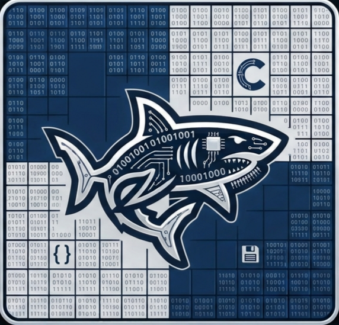

<div align="center">
  

  <h3>BITSHARK</h3>
   An average chess engine.
  <br>
</div>
  
## Overview

**Bitshark** é uma pequena chess engine feita em C para o jogo clássico de xadrez, que depois vai ser modificada para ser um BOT no modo história do jogo CChess, feito pelo mesmo criador desta engine.
<br>
Este projeto foi iniciado no dia **18 de julho de 2026** por um estudante de Engenharia Informática na UMinho.

## Tools

* Linguagem: **C**

## Features

* Search
  * NegaMax search
  * Alpha-Beta pruning
  * Quiescence Search
  * Move ordering
  * Iterative Deepening
  * Late Move Reductions
  * Search Principal Variation
  * Null Move Pruning
* Evaluation
  * Piece Square Tables
  * Incremental evaluation
  * Move repetition penalization
  * Static Exchange Evaluation
  * Piece Mobility Bonus 
    * MopUp Eval
    * King Safety 
    * Passed Pawns 
    * Rook Open Files
    * Number of attacked Squares
* Memorization Optimizations
  * Transposition Tables
  * Opening Book (Under Work)
  * Killer Moves
  * Move Heuristics
  * Magic Bitboards


## Estrutura do Projeto
```bash
.
├── assets/        # Assets maioritariamente em png do programa (Logo do bitshark inclusive)
├── build/         # Ficheiros binários (.o)
├── engine/        # Ficheiros do motor de xadrez em si 
├── gui/           # Ficheiros fonte da interface gráfica do programa
├── resources/     # Ficheiros resource (Opening Book , Benchmarks , MagicFinder , etc..)
├── sfx/           # Sons do jogo
├── bshark         # Executável , ficheiro .out
├── LICENSE        # Copyrights do programa
├── Makefile       # Ficheiro para criar os ficheiros .o pelo comando make
└── README.md      # Informações detalhadas sobre o projeto
```


## Compilação

Antes de compilar o projeto pode mudar certas flags para alterar o comportamento do programa. <br>

Em *___engine/chess_lib/engine.h___* pode mudar **CHECKMATE_BENCHMARK** para 1 para testar o bot a dar checkmate em endgames com KQ vs K ou KR vs K , para isso terá de alterar as flags de **BENCHMARK_TESTED** e **BENCHMARK_NOT_TESTED** para 5 e 4 , dependendo de qual quer e qual não quer testar (5 para queen e 4 para rook).<br>

Pode também mudar as flags **BOT_PLAYS_WHITE** para 0 e **BOT_PLAYS_BLACK** para 1 , por exemplo , jogar com as peças brancas , contra o bot com as pretas , ou deixar ambas a 1 para ver o bot a jogar contra si mesmo.
<br>

Para compilar este projeto e jogar contra o bot (que joga sempre com as pretas) execute o comando :

```
make bshark
```

E será gerado um executável chamado **bshark**. <br>

Para abrir o programa basta executar o comando 

```
./bshark
```
Pode também executar o seguinte comando , para verificar os NPS da engine , em posições pré-calculadas , tal como a depth que ela atinge , em média , em cada fase do jogo.

```
make bench
```
Para limpar o executável do **make bench** basta executar o comando :

```
make cleanb
```
Para limpar o executável **bshark** , tal como a pasta **build** , basta executar o comando :

```
make clean
```


## Créditos
Esta engine foi criada por Alberto Silva.

```⢰⠢⡀⠀⠀⠀⠀⠀⠀⠀⠀⠀⠀⠀⠀⠀⠀⠀⠀⠀⠀⠀⠀⠀⠀⠀⠀⠀⠀⠀
⠈⢧⠨⠢⡀⠀⠀⠀⠀⠀⠀⠲⢒⠒⠦⠤⣀⡀⠀⠀⠀⠀⢀⣠⣤⠴⠒⠋⠙⡄
⠀⠸⠀⠐⢱⠀⠀⠀⠀⠀⠀⢀⣈⠦⠤⠀⠒⠊⠉⠉⠀⠈⠁⣀⠭⠀⢁⣀⣀⣹
⠀⠀⠖⠀⠃⠓⢤⠖⠒⠚⠉⠀⠀⡀⠀⠀⠀⢀⣰⢴⠶⠐⢈⣴⣿⠟⠿⢻⣿⡞
⠀⢰⠀⠀⠀⡤⢤⣄⠀⠀⠤⠤⠀⠀⣐⠄⠀⠼⡏⡧⠄⢢⡾⠋⠀⠀⢠⣎⡟⠀
⢠⠃⣀⠴⠋⠀⠀⠈⠑⠢⢄⣀⣠⠊⠀⢀⠎⠀⠡⠅⠀⠻⢿⣤⣤⡴⣾⣴⣿⠀
⡬⠚⠁⠀⠀⠀⠀⠀⠀⠀⠀⡼⠃⣠⠶⣇⣀⣀⠀⠀⠀⠀⠀⣀⣌⡠⠤⠘⠋⠀
⠀⠀⠀⠀⠀⠀⠀⠀⠀⢀⣔⡡⠚⠁⠀⠀⠀⠈⠉⠉⠉⠻⡍⠙⡄⠀⠀⠀⠀⠀
⠀⠀⠀⠀⠀⠀⠀⠀⠀⠋⠁⠀⠀⠀⠀⠀⠀⠀⠀⠀⠀⠀⠈⠑⠃
```
